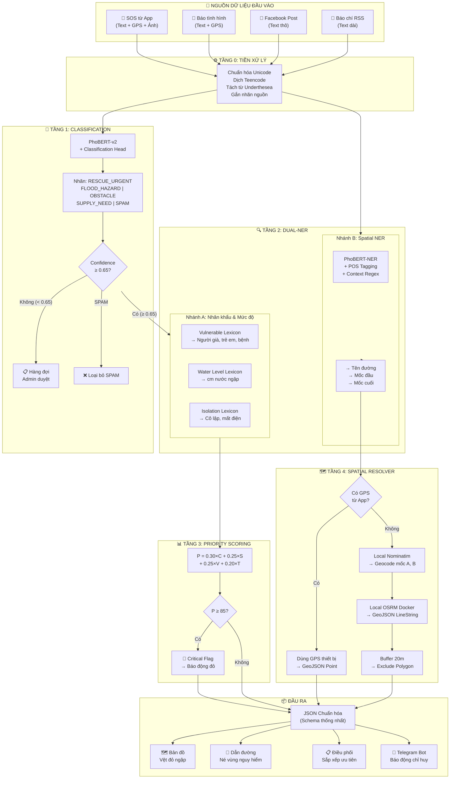

# ĐẶC TẢ CHI TIẾT MÔ HÌNH AI NÂNG CẤP
## Emergency Spatial-NLP Pipeline (ES-NLP)
### Hệ thống Trí tuệ Nhân tạo Phân tích Ngữ cảnh Thiên tai & Tái tạo Hình học Không gian

**Dự án:** Guardian Pulse — Hệ thống Điều phối Cứu hộ & Quản lý Thiên tai (DACN3)  
**Ngày lập:** 29/09/2026  
**Phiên bản:** 2.0 (Nâng cấp toàn diện từ mô hình AI v1.0 phân loại văn bản đơn thuần)  
**Tác giả:** Đội ngũ phát triển Guardian Pulse

---

## MỤC LỤC

1. [Tổng quan & Động lực nâng cấp](#1-tổng-quan--động-lực-nâng-cấp)
2. [Kiến trúc tổng thể Pipeline](#2-kiến-trúc-tổng-thể-pipeline)
3. [Tầng 0: Adapter & Tiền xử lý văn bản](#3-tầng-0-adapter--tiền-xử-lý-văn-bản)
4. [Tầng 1: Phân loại Ý định & Loại sự cố (Classification)](#4-tầng-1-phân-loại-ý-định--loại-sự-cố)
5. [Tầng 2: Bóc tách Thực thể Kép (Dual-NER & Entity Extraction)](#5-tầng-2-bóc-tách-thực-thể-kép)
6. [Tầng 3: Tính toán Điểm Ưu tiên Động (Dynamic Priority Scoring)](#6-tầng-3-tính-toán-điểm-ưu-tiên-động)
7. [Tầng 4: Tái tạo Hình học Không gian (Spatial Resolver & Polyline)](#7-tầng-4-tái-tạo-hình-học-không-gian)
8. [Đầu ra chuẩn hóa của Pipeline (JSON Schema)](#8-đầu-ra-chuẩn-hóa-của-pipeline)
9. [Thiết kế Hợp nhất: Một Pipeline — Bốn nguồn dữ liệu](#9-thiết-kế-hợp-nhất-một-pipeline--bốn-nguồn-dữ-liệu)
10. [Chuẩn bị Dữ liệu Huấn luyện](#10-chuẩn-bị-dữ-liệu-huấn-luyện)
11. [Công nghệ & Hạ tầng triển khai](#11-công-nghệ--hạ-tầng-triển-khai)
12. [Tích hợp với các Module khác trong hệ thống](#12-tích-hợp-với-các-module-khác-trong-hệ-thống)
13. [Sơ đồ Luồng End-to-End (Mermaid)](#13-sơ-đồ-luồng-end-to-end)
14. [So sánh AI v1.0 vs AI v2.0](#14-so-sánh-ai-v10-vs-ai-v20)
15. [Giá trị Học thuật & Điểm mạnh khi Bảo vệ Đồ án](#15-giá-trị-học-thuật)

---

## 1. TỔNG QUAN & ĐỘNG LỰC NÂNG CẤP

### 1.1. Mô hình AI hiện tại (v1.0) — Những hạn chế

Mô hình AI v1.0 trong dự án Guardian Pulse hiện chỉ thực hiện được **một nhiệm vụ duy nhất**: Phân loại văn bản thô vào các nhãn chung chung (`SOS`, `ALERT`, `SPAM`) bằng PhoBERT hoặc Rule-based fallback.

Các hạn chế chính:
* **Không bóc tách được thông tin chi tiết:** Chỉ biết "đây là tin cứu hộ" nhưng không biết cứu hộ ai (người già? trẻ em?), mức nước ngập bao nhiêu, ở đoạn đường nào.
* **Không tái tạo được hình học không gian:** Khi cào được bài Facebook ghi *"Đường Nguyễn Xiển từ ngã tư Nguyễn Trãi đến ngõ 214 ngập sâu"*, hệ thống chỉ biết chấm MỘT điểm mờ mịt giữa quận, không vẽ được CẢ ĐOẠN ĐƯỜNG bị ngập.
* **Không liên kết được với Động cơ Dẫn đường:** Dữ liệu AI đầu ra không có dạng hình học (Polygon/LineString) nên không thể đưa vào tham số `exclude_polygons` của OSRM/Valhalla để xe cứu hộ tự động tránh đoạn ngập.
* **Điểm ưu tiên vùng (`priority_score`) không tự cập nhật** khi có SOS mới hoặc khi trạng thái SOS thay đổi.

### 1.2. Mô hình AI nâng cấp (v2.0) — Mục tiêu

Xây dựng một **Pipeline AI Hợp nhất (Unified AI Pipeline)** xử lý tất cả các nguồn văn bản trong hệ thống qua **5 tầng xử lý liên hoàn**, biến văn bản thô thành **dữ liệu cấu trúc không gian-thời gian** phục vụ trực tiếp cho công tác cứu hộ.

**Nguyên tắc thiết kế:**
1. **100% Mã nguồn mở & Miễn phí** — Không gọi API trả phí bên ngoài (OpenAI, Gemini, Goong...).
2. **Chạy Offline/Cục bộ hoàn toàn** — Toàn bộ mô hình nạp vào RAM máy chủ Django, không phụ thuộc Internet.
3. **Một bộ não dùng chung** — Cùng một Pipeline phục vụ 4 nguồn dữ liệu: SOS, Báo tình hình, Facebook, Báo chí.
4. **Hàm lượng kỹ thuật cao** — Kết hợp NLP (PhoBERT), NER, Lexicon Matching, Spatial Computing (GIS/OSRM).

---

## 2. KIẾN TRÚC TỔNG THỂ PIPELINE

```
                       CÁC NGUỒN DỮ LIỆU ĐẦU VÀO
   ┌──────────────────────┬──────────────────────┬──────────────────────┐
   │                      │                      │                      │
   ▼                      ▼                      ▼                      ▼
[SOS từ App]       [Báo Tình Hình]       [Bài Đăng FB]          [Báo Chí RSS]
(Text + GPS + Ảnh)  (Text + GPS)         (Text thô, teencode)   (Text dài, chính thống)
   │                      │                      │                      │
   └──────────────────────┼──────────────────────┴──────────────────────┘
                          │
                          ▼
   ┌──────────────────────────────────────────────────────────────────────┐
   │               TẦNG 0: ADAPTER & TIỀN XỬ LÝ                         │
   │  • Chuẩn hóa Unicode (NFC)                                         │
   │  • Dịch Teencode → Tiếng Việt chuẩn                                │
   │  • Tách từ tiếng Việt (Word Segmentation) bằng Underthesea          │
   │  • Gắn nhãn nguồn (source_type) & phân luồng GPS                  │
   └────────────────────────────────┬─────────────────────────────────────┘
                                    │
                                    ▼
   ┌──────────────────────────────────────────────────────────────────────┐
   │            TẦNG 1: CLASSIFICATION (PhoBERT-v2 + Linear Head)        │
   │  • Đầu vào: Văn bản đã tách từ                                     │
   │  • Đầu ra: Nhãn sự cố + Confidence score                           │
   │  • Nhãn: RESCUE_URGENT | FLOOD_HAZARD | OBSTACLE | SUPPLY | SPAM   │
   │  • Ngưỡng: Confidence < 0.65 → Chuyển hàng đợi Admin duyệt       │
   └────────────────────────────────┬─────────────────────────────────────┘
                                    │
                                    ▼
   ┌──────────────────────────────────────────────────────────────────────┐
   │            TẦNG 2: DUAL-NER & ENTITY EXTRACTION                     │
   │  ┌──────────────────────────────┬──────────────────────────────┐    │
   │  │ NHÁNH A: Nhân khẩu & Mức độ │ NHÁNH B: Không gian/Mốc đường│    │
   │  │ • Người yếu thế (Lexicon)   │ • Tên đường (PhoBERT-NER)   │    │
   │  │ • Mức nước (Từ điển cm)     │ • Mốc đầu - Mốc cuối       │    │
   │  │ • Tình trạng cô lập/điện   │ • POS Tagging + Regex VN    │    │
   │  └──────────────────────────────┴──────────────────────────────┘    │
   └────────────────────────────────┬─────────────────────────────────────┘
                                    │
                                    ▼
   ┌──────────────────────────────────────────────────────────────────────┐
   │            TẦNG 3: SEVERITY & PRIORITY SCORING (0 – 100)            │
   │  • Công thức có trọng số: Loại sự cố + Mức nước + Nhân khẩu + Thời gian │
   │  • Cờ Critical Flag khi P ≥ 85                                      │
   │  • Thay thế hoàn toàn cách tính priority_score cũ                   │
   └────────────────────────────────┬─────────────────────────────────────┘
                                    │
                                    ▼
   ┌──────────────────────────────────────────────────────────────────────┐
   │            TẦNG 4: SPATIAL RESOLVER & POLYLINE GENERATOR            │
   │  ┌───────────────────────────┬──────────────────────────────────┐   │
   │  │ CÓ GPS (từ App)          │ CHƯA CÓ GPS (từ FB/Báo chí)    │   │
   │  │ • Dùng GPS thiết bị      │ • Local Nominatim → Geocode A,B │   │
   │  │ • Gom Zone (DBSCAN 300m) │ • Local OSRM → LineString A→B  │   │
   │  │ • Tạo Point geometry     │ • Buffer 20m → exclude_polygons │   │
   │  └───────────────────────────┴──────────────────────────────────┘   │
   └────────────────────────────────┬─────────────────────────────────────┘
                                    │
                                    ▼
                          JSON ĐẦU RA CHUẨN HÓA
                    (Phục vụ Bản đồ, Dẫn đường, Điều phối)
```

---

## 3. TẦNG 0: ADAPTER & TIỀN XỬ LÝ VĂN BẢN

### 3.1. Mục đích
Chuẩn hóa mọi dạng văn bản đầu vào (teencode, emoji, viết tắt, HTML entities) thành chuỗi văn bản tiếng Việt sạch, đã tách từ, sẵn sàng đưa vào mô hình PhoBERT.

### 3.2. Các bước xử lý tuần tự

#### Bước 1: Chuẩn hóa Unicode
```python
import unicodedata
text = unicodedata.normalize('NFC', raw_text)
```
Mục đích: Đảm bảo ký tự có dấu tiếng Việt (`ă`, `ơ`, `ư`, `ê`...) được biểu diễn thống nhất, tránh lỗi so khớp từ.

#### Bước 2: Loại bỏ nhiễu
* Xóa thẻ HTML (`<br>`, `<a href=...>`), URL, hashtag quá dài.
* Giữ lại emoji cảm xúc có giá trị ngữ nghĩa: 🆘 → `"cứu"`, 🔴 → `"nguy hiểm"`, 💀 → `"chết"`.
* Loại bỏ số điện thoại (thay bằng token `[PHONE]`) để bảo vệ thông tin cá nhân.

#### Bước 3: Dịch Teencode → Tiếng Việt chuẩn
Xây dựng từ điển teencode thường gặp trong ngữ cảnh bão lũ/kêu cứu trên mạng xã hội Việt Nam:

```python
TEENCODE_DICT = {
    "k": "không", "ko": "không", "hk": "không",
    "ng": "người", "ngta": "người ta",
    "dc": "được", "dk": "được",
    "trc": "trước", "ns": "nói",
    "vs": "với", "j": "gì", "gj": "gì",
    "r": "rồi", "oy": "rồi",
    "lm": "làm", "nc": "nước",
    "dt": "điện thoại", "sdt": "số điện thoại",
    "a": "anh", "e": "em", "m": "mình",
    "nhìu": "nhiều", "bjo": "bây giờ", "h": "giờ",
    "tke": "thằng kia kìa", "ck": "chồng",
    "bth": "bình thường", "bt": "biết",
    "cx": "cũng", "mn": "mọi người",
    "ib": "inbox", "fb": "facebook",
    "sos": "cầu cứu khẩn cấp",
}
```

#### Bước 4: Tách từ tiếng Việt (Word Segmentation)
Sử dụng thư viện mã nguồn mở **Underthesea**:
```python
from underthesea import word_tokenize

text = "nước ngập ngang yên xe trên đường Nguyễn Xiển"
segmented = word_tokenize(text, format="text")
# Kết quả: "nước_ngập ngang yên_xe trên đường Nguyễn_Xiển"
```
PhoBERT yêu cầu đầu vào phải qua bước tách từ này để hoạt động chính xác.

#### Bước 5: Gắn nhãn nguồn (Source Tagging)
Mỗi văn bản được gắn metadata nguồn gốc để các tầng sau xử lý phù hợp:
```python
source_type = "SOS_APP"          # Form SOS từ app người dân
source_type = "FIELD_REPORT"     # Báo tình hình đường sá từ app
source_type = "FACEBOOK_POST"    # Bài đăng Facebook cào được
source_type = "NEWS_ARTICLE"     # Bài báo chí RSS
```

### 3.3. Vị trí trong mã nguồn
* File: `backend/ai/preprocessor.py`
* Hàm chính: `preprocess_text(raw_text: str, source_type: str) -> dict`
* Từ điển Teencode: `backend/ai/data/teencode_dict.json`

---

## 4. TẦNG 1: PHÂN LOẠI Ý ĐỊNH & LOẠI SỰ CỐ

### 4.1. Mục đích
Xác định văn bản thuộc loại sự cố nào trong 5 nhãn phân loại, đồng thời lọc bỏ tin rác/spam ngay từ đầu pipeline.

### 4.2. Mô hình sử dụng
* **Base Model:** `vinai/phobert-base-v2` (Pre-trained Language Model cho tiếng Việt, do VinAI Research phát triển).
* **Kiến trúc Fine-tune:** Thêm 1 tầng `Linear Classification Head` gồm:
  * Lớp Dropout (p=0.3) chống overfitting.
  * Lớp Linear: 768 → 5 (ánh xạ vector biểu diễn câu sang 5 nhãn).
  * Hàm kích hoạt: Softmax (trả về phân bố xác suất trên 5 nhãn).

### 4.3. Không gian nhãn (Label Space)

| Mã nhãn | Ý nghĩa | Ví dụ văn bản |
|---|---|---|
| `RESCUE_URGENT` | Kêu cứu khẩn cấp liên quan sinh mạng con người: kẹt trên mái, người trôi, cô lập hoàn toàn. | *"Cả nhà em 5 người kẹt trên gác lửng, nước dâng sắp chạm trần rồi cứu với!"* |
| `FLOOD_HAZARD` | Cảnh báo ngập đường sá, nước dâng cao gây nguy hiểm giao thông và đời sống. | *"Đoạn đường Nguyễn Xiển từ ngã tư Nguyễn Trãi đến ngõ 214 ngập sâu ngang yên xe."* |
| `OBSTACLE` | Chướng ngại vật chắn đường: cây đổ, dây điện đứt, cầu sập, sạt lở taluy, đất đá. | *"Cây xà cừ đổ chắn ngang đường Lê Duẩn, dây điện rơi xuống mặt nước rất nguy hiểm."* |
| `SUPPLY_NEED` | Cần hỗ trợ nhu yếu phẩm: lương thực, nước sạch, áo phao, thuốc men, chăn ấm. | *"Xóm em bị cô lập 3 ngày rồi, hết gạo hết nước, có 2 cháu nhỏ đang sốt cao."* |
| `SPAM_IRRELEVANT` | Tin không liên quan: quảng cáo, tin cứu trợ cũ đã xử lý, chuyện phiếm, chia sẻ video giải trí. | *"Bán nhà mặt tiền Quốc lộ 1A giá tốt, liên hệ..."* |

### 4.4. Ngưỡng tin cậy & Cơ chế fallback
* Kết quả trả về: `(label, confidence)` — ví dụ: `("FLOOD_HAZARD", 0.94)`.
* **Nếu `confidence ≥ 0.65`:** Tự động chuyển sang Tầng 2 tiếp tục xử lý.
* **Nếu `confidence < 0.65`:** Đưa vào hàng đợi `PENDING_REVIEW` để Admin duyệt thủ công trên Dashboard. Tránh tình trạng AI đoán sai gây hậu quả nghiêm trọng.
* **Nếu nhãn = `SPAM_IRRELEVANT`:** Loại bỏ, không đưa vào các tầng sau. Lưu vào bảng `CrawledArticle` với trạng thái `REJECTED_SPAM`.

### 4.5. Huấn luyện
* **Tập dữ liệu:** 300–500 câu, cân bằng giữa 5 nhãn, thu thập từ:
  * Bài đăng Facebook các trang cứu hộ bão lũ miền Trung (2020–2024).
  * Bài báo VnExpress, Tuổi Trẻ, Dân Trí mục Thiên tai.
  * Dữ liệu tổng hợp viết tay mô phỏng các tình huống kêu cứu.
* **Huấn luyện:** Google Colab (GPU T4 miễn phí), ~10–15 phút cho 10 epoch.
* **Lưu trữ checkpoint:** `backend/ai/weights/phobert_classifier.pt` (~350MB).

### 4.6. Vị trí trong mã nguồn
* File: `backend/ai/classifier.py`
* Hàm chính: `classify_incident(segmented_text: str) -> Tuple[str, float]`
* Model loader: `backend/ai/model_loader.py` — Load PhoBERT vào RAM 1 lần duy nhất khi Django khởi động (qua `AppConfig.ready()`).

---

## 5. TẦNG 2: BÓC TÁCH THỰC THỂ KÉP (DUAL-NER & ENTITY EXTRACTION)

Tầng này chạy **song song 2 nhánh** trích xuất thông tin từ cùng một đoạn văn bản:

### 5.1. NHÁNH A: Trích xuất Nguy cơ Nhân khẩu & Mức nước

#### 5.1.1. Mục đích
Tự động nhận diện các yếu tố ảnh hưởng trực tiếp đến mức độ nguy cấp: đối tượng yếu thế, mức nước thực tế, tình trạng cô lập.

#### 5.1.2. Phương pháp: Rule-based Semantic Lexicon + Fuzzy Matching

**a) Từ điển Nhân khẩu Yếu thế (Vulnerable Demographics Lexicon):**

Phát hiện các cụm từ mô tả đối tượng cần ưu tiên cứu hộ:

```python
VULNERABLE_LEXICON = {
    # Người cao tuổi
    "người_già": "ELDERLY", "cụ_già": "ELDERLY", "ông_bà": "ELDERLY",
    "bà_cụ": "ELDERLY", "ông_cụ": "ELDERLY", "cao_tuổi": "ELDERLY",

    # Trẻ em
    "trẻ_em": "CHILD", "trẻ_nhỏ": "CHILD", "trẻ_sơ_sinh": "INFANT",
    "em_bé": "CHILD", "cháu_bé": "CHILD", "con_nhỏ": "CHILD",

    # Người bệnh / Khuyết tật
    "tai_biến": "DISABLED", "liệt": "DISABLED", "xe_lăn": "DISABLED",
    "chạy_thận": "CRITICAL_MEDICAL", "mang_bầu": "PREGNANT",
    "bầu": "PREGNANT", "thai_phụ": "PREGNANT",
    "sốt_cao": "SICK", "bệnh_nặng": "CRITICAL_MEDICAL",
    "thở_máy": "CRITICAL_MEDICAL", "bình_oxy": "CRITICAL_MEDICAL",
}
```

**b) Từ điển Mức nước (Water Level Lexicon):**

Ánh xạ mô tả ngôn ngữ tự nhiên sang chiều cao nước tính bằng centimet:

```python
WATER_LEVEL_LEXICON = {
    # ═══════════════════════════════════════════════════
    # MỨC 1 — AN TOÀN CÓ ĐIỀU KIỆN (10 – 20 cm)
    # Xe máy đi chậm được, ô tô gầm thấp cẩn thận
    # ═══════════════════════════════════════════════════
    "mắt_cá": 15,
    "ngập_nhẹ": 15,
    "mấp_mé_vỉa_hè": 20,
    "ngập_lốp": 20,
    "le_te": 10,

    # ═══════════════════════════════════════════════════
    # MỨC 2 — CẢNH BÁO (30 – 50 cm)
    # Xe máy bắt đầu chết máy, ô tô gầm thấp không qua được
    # ═══════════════════════════════════════════════════
    "nửa_bánh_xe": 30,
    "ngang_gối": 45,
    "chạm_bô": 40,
    "lút_bánh": 50,
    "ngang_ống_chân": 35,
    "chết_máy": 40,

    # ═══════════════════════════════════════════════════
    # MỨC 3 — NGUY HIỂM (60 – 100 cm)
    # Chỉ xe tải gầm cao hoặc ca-nô qua được
    # ═══════════════════════════════════════════════════
    "ngang_yên_xe": 75,
    "ngang_hông": 80,
    "ngang_bụng": 90,
    "ngang_thắt_lưng": 85,
    "quá_bánh_xe": 70,
    "ngập_sâu": 80,

    # ═══════════════════════════════════════════════════
    # MỨC 4 — THẢM HỌA (> 100 cm)
    # Cần ca-nô / trực thăng, nguy cơ tử vong cao
    # ═══════════════════════════════════════════════════
    "ngang_ngực": 120,
    "ngập_đầu": 160,
    "nóc_nhà": 250,
    "gác_lửng": 200,
    "mái_nhà": 250,
    "tầng_2": 350,
    "cuốn_trôi": 200,
}
```

**c) Từ điển Tình trạng Cô lập (Isolation Status Lexicon):**

```python
ISOLATION_LEXICON = {
    "cô_lập": True, "bị_cắt": True, "chia_cắt": True,
    "không_ra_được": True, "mắc_kẹt": True, "kẹt": True,
    "mất_điện": True, "mất_sóng": True, "mất_liên_lạc": True,
    "không_có_đồ_ăn": True, "hết_lương_thực": True,
    "hết_nước_sạch": True, "hết_gạo": True,
}
```

**d) Thuật toán Fuzzy Matching:**

Sử dụng thư viện `thefuzz` (Python) để xử lý trường hợp người dân viết sai chính tả hoặc diễn đạt khác (ví dụ: `"ngập ngan gối"` thay vì `"ngập ngang gối"`):

```python
from thefuzz import fuzz, process

def match_water_level(text: str) -> Optional[int]:
    best_match, score = process.extractOne(
        text, WATER_LEVEL_LEXICON.keys(),
        scorer=fuzz.partial_ratio
    )
    if score >= 80:
        return WATER_LEVEL_LEXICON[best_match]
    return None
```

#### 5.1.3. Đầu ra Nhánh A
```python
{
    "has_vulnerable": True,
    "vulnerable_types": ["ELDERLY", "CHILD"],
    "vulnerable_count": 3,             # Số người yếu thế phát hiện được
    "water_level_desc": "ngang yên xe", # Mô tả gốc từ văn bản
    "water_level_cm": 75,              # Quy đổi sang centimet
    "water_level_grade": 3,            # Mức cảnh báo (1–4)
    "is_isolated": True,               # Có bị cô lập không
    "isolation_factors": ["mất_điện", "hết_lương_thực"]
}
```

---

### 5.2. NHÁNH B: Trích xuất Cấu trúc Không gian (Spatial NER)

#### 5.2.1. Mục đích
Bóc tách 3 thành phần cấu thành một đoạn đường bị ảnh hưởng:
* **T** (Tên trục đường chính): `Nguyễn Xiển`, `Quốc lộ 1A`.
* **M_start** (Mốc bắt đầu): `ngã tư Nguyễn Trãi`, `cầu vượt Thanh Xuân`.
* **M_end** (Mốc kết thúc): `ngõ 214`, `cổng trường ĐH Bách Khoa`.

#### 5.2.2. Phương pháp: Hybrid Model (PhoBERT-NER + POS Tagging + Context Regex)

Kết hợp 3 kỹ thuật để đạt độ chính xác cao nhất:

**a) PhoBERT-NER (Nhận dạng thực thể tên riêng):**

Sử dụng mô hình `phobert-base` fine-tune thêm NER head để gắn nhãn BIO cho từng token:
* `B-LOC`: Token bắt đầu của địa danh (Beginning of Location).
* `I-LOC`: Token tiếp theo trong cùng cụm địa danh (Inside of Location).
* `O`: Token không phải địa danh (Outside).

Ví dụ:
```
nước_ngập | ngang | yên_xe | trên | đường  | Nguyễn_Xiển | từ | ngã_tư | Nguyễn_Trãi | đến | ngõ | 214
O         | O     | O      | O    | B-LOC  | I-LOC       | O  | B-LOC  | I-LOC       | O   | B-LOC| I-LOC
```

**b) POS Tagging (Phân tích từ loại) bằng Underthesea:**

```python
from underthesea import pos_tag
result = pos_tag("đường Nguyễn Xiển ngập từ ngã tư đến ngõ 214")
# [('đường', 'N'), ('Nguyễn Xiển', 'Np'), ('ngập', 'V'),
#  ('từ', 'E'), ('ngã tư', 'N'), ('đến', 'E'), ('ngõ', 'N'), ('214', 'M')]
```
Lọc ra các cụm `Np` (Danh từ riêng — Proper Noun) làm ứng viên địa danh.

**c) Context Regex Patterns (Mẫu cú pháp ngữ cảnh tiếng Việt):**

Tiếng Việt có cấu trúc câu mô tả vị trí rất đặc thù. Xây dựng bộ mẫu regex:

```python
SPATIAL_PATTERNS = [
    # Mẫu 1: "đường X từ A đến B"
    r"(?:đường|phố|tuyến)\s+(?P<street>[A-ZÀ-Ỹ][a-zà-ỹA-ZÀ-Ỹ0-9\s]+?)"
    r"\s+(?:từ|bắt đầu từ|đoạn từ)\s+(?P<start>[^,\.]+?)"
    r"\s+(?:đến|tới|qua|hết)\s+(?P<end>[^,\.]+)",

    # Mẫu 2: "đoạn A đến B trên đường X"
    r"(?:đoạn|từ)\s+(?P<start>[^,\.]+?)"
    r"\s+(?:đến|tới)\s+(?P<end>[^,\.]+?)"
    r"\s+(?:trên|thuộc)?\s*(?:đường|phố)\s+(?P<street>[A-ZÀ-Ỹ][a-zà-ỹA-ZÀ-Ỹ0-9\s]+)",

    # Mẫu 3: "ngập tại đường X, đoạn gần A"
    r"(?:tại|ở|trên)\s+(?:đường|phố)\s+(?P<street>[A-ZÀ-Ỹ][a-zà-ỹA-ZÀ-Ỹ0-9\s]+?)"
    r"(?:\s*,?\s*(?:đoạn\s+)?(?:gần|cạnh|ngay|trước|sau)\s+(?P<start>[^,\.]+))?",

    # Mẫu 4: "ngã tư A - B" (giao lộ)
    r"(?:ngã\s*(?:tư|ba|năm|sáu))\s+(?P<start>[A-ZÀ-Ỹ][a-zà-ỹA-ZÀ-Ỹ\s]+?)"
    r"\s*[-–/]\s*(?P<end>[A-ZÀ-Ỹ][a-zà-ỹA-ZÀ-Ỹ\s]+)",

    # Mẫu 5: "QL1A km 105 đến km 108"
    r"(?P<street>(?:QL|quốc\s*lộ|TL|tỉnh\s*lộ)\s*\d+[A-Z]?)"
    r"\s+(?:km\s*)?(?P<start>\d+)\s*(?:đến|[-–])\s*(?:km\s*)?(?P<end>\d+)",
]
```

**d) Thuật toán kết hợp (Ensemble Logic):**

```
1. Chạy PhoBERT-NER → Danh sách entities NER
2. Chạy POS Tagging → Danh sách Np (Proper Noun)
3. Chạy Regex Patterns → Nhóm (street, start, end)
4. Hợp nhất kết quả:
   - Nếu Regex khớp (có đủ street + start) → Ưu tiên dùng Regex (chính xác nhất)
   - Nếu Regex không khớp → Dùng kết quả NER + POS Tagging:
     * Entity B-LOC đầu tiên sau từ "đường/phố" → street
     * Entity B-LOC sau từ "từ/tại" → start
     * Entity B-LOC sau từ "đến/tới" → end
   - Kiểm tra chéo: Entity NER phải overlap với Np (POS) → Tăng confidence
```

#### 5.2.3. Đầu ra Nhánh B
```python
{
    "has_spatial": True,
    "street_name": "Nguyễn Xiển",
    "start_landmark": "ngã tư Nguyễn Trãi",
    "end_landmark": "ngõ 214",
    "district": "Thanh Xuân",    # Suy luận từ ngữ cảnh nếu có
    "city": "Hà Nội",           # Suy luận từ ngữ cảnh nếu có
    "spatial_confidence": 0.88
}
```

### 5.3. Vị trí trong mã nguồn
* File Nhánh A: `backend/ai/severity_extractor.py`
* File Nhánh B: `backend/ai/spatial_ner.py`
* Từ điển dữ liệu: `backend/ai/data/vulnerable_lexicon.json`, `backend/ai/data/water_level_lexicon.json`, `backend/ai/data/spatial_patterns.json`
* Hàm tổng hợp: `backend/ai/dual_ner.py` → `extract_entities(segmented_text: str) -> dict`

---

## 6. TẦNG 3: TÍNH TOÁN ĐIỂM ƯU TIÊN ĐỘNG (DYNAMIC PRIORITY SCORING)

### 6.1. Mục đích
Thay thế hoàn toàn cách tính `priority_score` cũ (chỉ dựa trên số lượng SOS, nhân lực thiếu). Mô hình mới tính điểm dựa trên **nội dung ngữ nghĩa của văn bản** kết hợp với **yếu tố thời gian**.

### 6.2. Công thức tính điểm

```
P = w₁ × C_type + w₂ × S_water + w₃ × V_vulnerable + w₄ × T_waiting
```

Trong đó:

| Thành phần | Ký hiệu | Trọng số | Giải thích | Thang điểm |
|---|---|---|---|---|
| Loại sự cố | C_type | w₁ = 0.30 | Dựa trên nhãn Classification Tầng 1 | 0 – 100 |
| Mức nước | S_water | w₂ = 0.25 | Dựa trên Water Level Lexicon Tầng 2A | 0 – 100 |
| Nhân khẩu yếu thế | V_vulnerable | w₃ = 0.25 | Dựa trên Vulnerable Lexicon Tầng 2A | 0 – 100 |
| Thời gian chờ | T_waiting | w₄ = 0.20 | Tính từ lúc tạo SOS đến hiện tại | 0 – 100 |

### 6.3. Chi tiết quy đổi từng thành phần

**a) C_type — Điểm theo Loại sự cố:**

| Nhãn | Điểm |
|---|---|
| `RESCUE_URGENT` (Cứu sinh mạng) | 100 |
| `FLOOD_HAZARD` (Ngập sâu) | 60 |
| `OBSTACLE` (Cây đổ / Sạt lở) | 50 |
| `SUPPLY_NEED` (Cần lương thực) | 40 |
| `SPAM_IRRELEVANT` | 0 (không vào scoring) |

**b) S_water — Điểm theo Mức nước:**

| Mức nước (cm) | Mức cảnh báo | Điểm |
|---|---|---|
| 0 – 20 cm | Mức 1 (Cảnh giác) | 20 |
| 21 – 50 cm | Mức 2 (Cảnh báo) | 50 |
| 51 – 100 cm | Mức 3 (Nguy hiểm) | 80 |
| > 100 cm | Mức 4 (Thảm họa) | 100 |
| Không xác định | — | 30 (mặc định) |

**c) V_vulnerable — Điểm theo Nhân khẩu yếu thế:**

| Điều kiện phát hiện | Điểm |
|---|---|
| Không phát hiện đối tượng yếu thế | 0 |
| Có người già HOẶC trẻ em | 60 |
| Có người bệnh nặng / khuyết tật / thai phụ | 80 |
| Có trẻ sơ sinh HOẶC người thở máy / chạy thận | 100 |
| Có nhiều nhóm yếu thế cùng lúc | 100 |

**d) T_waiting — Điểm theo Thời gian chờ:**

Đây là thành phần **tự động tăng theo thời gian**, đảm bảo không có SOS nào bị bỏ quên:

```python
import math

def calc_time_score(created_at: datetime) -> float:
    minutes_waiting = (now() - created_at).total_seconds() / 60
    # Hàm logarit: tăng nhanh ban đầu, chậm dần về sau
    # 0 phút → 0 điểm, 30 phút → 50 điểm, 120 phút → 80 điểm, 360 phút → 100 điểm
    score = min(100, 20 * math.log2(1 + minutes_waiting / 10))
    return score
```

### 6.4. Cờ báo động đỏ (Critical Flag)

Khi điểm ưu tiên **P ≥ 85**, hệ thống tự động:
1. Gắn cờ `is_critical = True` lên bản ghi SOS/CrowdReport.
2. Kích hoạt chuông báo động đỏ trên Dashboard Admin (qua SSE — Tầng T8).
3. Bắn tin Telegram Bot vào nhóm chỉ huy (nếu T9 đã triển khai).
4. Đẩy SOS này lên đầu hàng đợi điều phối.

### 6.5. Khi nào tính lại điểm?
Điểm `priority_score` được **tính lại tự động** khi:
* Có SOS mới được tạo trong Zone.
* SOS thay đổi trạng thái (PENDING → ACKNOWLEDGED → RESOLVED).
* Mission thay đổi trạng thái (ACTIVE → NEEDS_HELP → COMPLETED).
* Mỗi 5 phút (cronjob) để cập nhật thành phần `T_waiting`.

### 6.6. Vị trí trong mã nguồn
* File: `backend/ai/priority_scorer_v2.py`
* Hàm chính: `calculate_priority(analysis_result: dict, created_at: datetime) -> Tuple[int, bool]`
* Trả về: `(priority_score: int, is_critical: bool)`

---

## 7. TẦNG 4: TÁI TẠO HÌNH HỌC KHÔNG GIAN (SPATIAL RESOLVER & POLYLINE GENERATOR)

### 7.1. Mục đích
Biến thông tin địa lý dạng văn bản (tên đường, mốc đầu, mốc cuối) thành **dữ liệu hình học GeoJSON** hiển thị được trên bản đồ và đưa vào thuật toán dẫn đường.

### 7.2. Hai nhánh xử lý theo nguồn dữ liệu

#### Nhánh 1: Dữ liệu từ App (Đã có GPS sẵn)

Khi dữ liệu đến từ Form SOS hoặc Báo tình hình trên app người dân, thiết bị đã gửi kèm tọa độ GPS chính xác.

```
Đầu vào: (lat=20.9981, lng=105.8012, accuracy=15m)

Xử lý:
1. Tạo đối tượng GeoJSON Point
2. Gọi thuật toán Gom cụm (Clustering):
   - Tìm Zone ACTIVE/STABILIZING có tâm trong bán kính 300m
   - Nếu tìm thấy → Gán SOS vào Zone đó
   - Nếu không → Tạo Zone mới

Đầu ra: GeoJSON Point + zone_id
```

Nếu người dân chọn báo **đoạn đường** (chạm 2 điểm trên bản đồ):
```
Đầu vào: Point_A (lat1, lng1) + Point_B (lat2, lng2)

Xử lý:
1. Gọi Local OSRM: Tìm đường thực tế nối A → B dọc theo đường phố
2. Trả về GeoJSON LineString (tọa độ uốn theo tim đường)

Đầu ra: GeoJSON LineString
```

#### Nhánh 2: Dữ liệu từ Facebook/Báo chí (Chỉ có Text — Không có GPS)

Khi dữ liệu là bài cào từ mạng xã hội hoặc báo chí, chỉ có thông tin địa danh dạng văn bản.

**Luồng xử lý 4 bước:**

```
Bước 1: Nhận kết quả từ Tầng 2 Nhánh B
   street_name = "Nguyễn Xiển"
   start_landmark = "ngã tư Nguyễn Trãi"
   end_landmark = "ngõ 214"
   city = "Hà Nội"

Bước 2: Geocoding điểm đầu (Local Nominatim / OSM Cache)
   Query: "ngã tư Nguyễn Trãi Nguyễn Xiển, Hà Nội"
   Kết quả: Point_A = (20.9981, 105.8012)

Bước 3: Geocoding điểm cuối
   Query: "ngõ 214 Nguyễn Xiển, Hà Nội"
   Kết quả: Point_B = (20.9912, 105.8062)

Bước 4: Dựng Polyline bằng Local OSRM
   Request: GET http://localhost:5000/route/v1/driving/105.8012,20.9981;105.8062,20.9912
            ?overview=full&geometries=geojson
   Response: GeoJSON LineString với hàng chục tọa độ uốn lượn theo tim đường thực tế

Bước 5 (Bonus): Buffer Polygon cho Dẫn đường
   Mở rộng (buffer) LineString ra 20m mỗi bên → Polygon vùng nguy hiểm
   → Đưa vào tham số exclude_polygons của OSRM/Valhalla khi tính lộ trình cứu hộ
```

### 7.3. Chiến lược Geocoding cục bộ (Local Geocoding Strategy)

Để đảm bảo **0 đồng chi phí** và **chạy offline**, xây dựng hệ thống Geocoding 3 lớp:

**Lớp 1: Cache SQLite nội bộ (Nhanh nhất — 1ms)**
* Xây dựng sẵn bảng `LocationCache` trong SQLite chứa ~5000 mốc đường phổ biến:
  * Ngã tư, ngã ba, cầu, cống, trường học, bệnh viện, chợ, bến xe.
  * Dữ liệu lấy từ OSM Overpass API (1 lần duy nhất) cho các thành phố trọng điểm: Hà Nội, Đà Nẵng, TP.HCM.
* Khi NER trích xuất được `"ngã tư Nguyễn Trãi"`, tra bảng cache trước.

**Lớp 2: Local Nominatim (Trung bình — 50ms)**
* Cài đặt Nominatim cục bộ bằng Docker + import file `vietnam-latest.osm.pbf` (~500MB).
* Fallback khi cache không có dữ liệu.

**Lớp 3: Nominatim Public API (Dự phòng — 500ms)**
* Gọi `https://nominatim.openstreetmap.org/search?q=...` khi 2 lớp trên đều thất bại.
* Rate limit: 1 request/giây (tuân thủ chính sách OSM).

### 7.4. Xử lý trường hợp đặc biệt

| Trường hợp | Cách xử lý |
|---|---|
| Chỉ có tên đường, không có mốc đầu/cuối | Geocode tên đường → Lấy trung điểm → Tạo Point + vòng tròn bán kính 200m |
| Chỉ có mốc đầu, không có mốc cuối | Geocode mốc đầu → Tạo Point + vòng tròn bán kính 150m |
| Geocode thất bại (không tìm thấy) | Ghi log cảnh báo, đưa vào hàng đợi Admin duyệt thủ công với gợi ý từ AI |
| Có cả 2 mốc nhưng khoảng cách > 10km | Cảnh báo bất thường (có thể bóc tách sai), yêu cầu Admin kiểm tra |
| Giao lộ (chỉ có "ngã tư X - Y") | Geocode tên giao lộ → Tạo Point tại vị trí giao nhau |

### 7.5. Vị trí trong mã nguồn
* File: `backend/ai/spatial_resolver.py`
* Hàm chính: `resolve_spatial(ner_result: dict, source_type: str, gps: dict = None) -> dict`
* Cache DB: `backend/ai/data/location_cache.sqlite`
* Config OSRM: `backend/ai/config.py` → `OSRM_LOCAL_URL = "http://localhost:5000"`

---

## 8. ĐẦU RA CHUẨN HÓA CỦA PIPELINE (JSON SCHEMA)

Bất kể văn bản đầu vào đến từ nguồn nào (SOS, Báo tình hình, Facebook, Báo chí), sau khi đi qua 5 tầng xử lý, hệ thống đều trả về **một cấu trúc JSON đồng nhất duy nhất**:

```json
{
    "pipeline_version": "2.0",
    "processed_at": "2026-09-29T09:30:15+07:00",
    "processing_time_ms": 42,

    "source": {
        "type": "FACEBOOK_POST",
        "raw_text": "Cảnh báo bà con: đường Nguyễn Xiển từ ngã tư Nguyễn Trãi đến ngõ 214 ngập sâu ngang yên xe, có 1 cụ già mắc kẹt trên tầng 2. Mất điện mất nước rồi.",
        "crawled_article_id": "fb_12345",
        "original_url": "https://facebook.com/groups/..."
    },

    "classification": {
        "intent": "RESCUE_URGENT",
        "confidence": 0.94,
        "sub_type": "FLOOD_HAZARD"
    },

    "demographics": {
        "has_vulnerable": true,
        "vulnerable_types": ["ELDERLY"],
        "vulnerable_detail": "1 cụ già mắc kẹt trên tầng 2",
        "estimated_people_count": 1
    },

    "severity": {
        "water_level_raw": "ngang yên xe",
        "water_level_cm": 75,
        "water_level_grade": 3,
        "grade_label": "NGUY_HIEM",
        "passable_vehicles": ["TRUCK", "BOAT"],
        "is_isolated": true,
        "isolation_factors": ["mất_điện", "mất_nước"]
    },

    "priority": {
        "score": 92,
        "is_critical": true,
        "breakdown": {
            "C_type": 100,
            "S_water": 80,
            "V_vulnerable": 100,
            "T_waiting": 0
        }
    },

    "spatial": {
        "has_geometry": true,
        "geometry_type": "LineString",
        "input_method": "NER_GEOCODED",
        "street_name": "Nguyễn Xiển",
        "landmarks": {
            "start": "ngã tư Nguyễn Trãi",
            "end": "ngõ 214"
        },
        "geocoded_points": {
            "start": {"lat": 20.9981, "lng": 105.8012},
            "end": {"lat": 20.9912, "lng": 105.8062}
        },
        "geojson": {
            "type": "Feature",
            "geometry": {
                "type": "LineString",
                "coordinates": [
                    [105.8012, 20.9981],
                    [105.8020, 20.9970],
                    [105.8035, 20.9950],
                    [105.8048, 20.9935],
                    [105.8062, 20.9912]
                ]
            },
            "properties": {
                "hazard_type": "FLOOD",
                "water_level_cm": 75,
                "buffer_meters": 20,
                "source": "AI_NER"
            }
        },
        "exclude_polygon": {
            "type": "Polygon",
            "coordinates": [["... (buffer 20m quanh LineString) ..."]]
        }
    },

    "action_suggested": "CREATE_SOS_AND_HAZARD_SEGMENT",
    "requires_admin_review": false
}
```

---

## 9. THIẾT KẾ HỢP NHẤT: MỘT PIPELINE — BỐN NGUỒN DỮ LIỆU

### 9.1. Tại sao dùng chung một Pipeline?

1. **Tiết kiệm tài nguyên:** Chỉ nạp (load) mô hình PhoBERT vào RAM **một lần duy nhất** khi Django khởi động. Mọi request đều dùng chung instance này.
2. **Học tập chéo (Cross-domain Learning):** Cùng cụm từ `"nước ngập đến cổ"` dù xuất hiện ở Facebook hay SOS đều được hiểu đúng là nguy cấp.
3. **Dễ bảo trì:** Sửa từ điển Lexicon 1 chỗ → Tất cả 4 nguồn đều được cập nhật.
4. **Đầu ra đồng nhất:** Mọi nguồn đều cho ra cùng JSON Schema → Frontend và các module khác chỉ cần parse 1 định dạng.

### 9.2. Cách Pipeline ứng xử khác nhau theo từng nguồn

| Nguồn dữ liệu | Có GPS sẵn? | Tầng 1 (Classify) | Tầng 2A (Nhân khẩu) | Tầng 2B (Spatial NER) | Tầng 3 (Priority) | Tầng 4 (Geocoding) | Kết quả đầu ra |
|---|---|---|---|---|---|---|---|
| **SOS từ App** | ✅ Có | ✅ Chạy (phân loại nhu cầu) | ✅ Chạy (bóc tách người yếu thế từ ghi chú) | ⏭️ Bỏ qua (đã có GPS) | ✅ Chạy | ⏭️ Bỏ qua (dùng GPS thiết bị) | SOS + Point + Priority |
| **Báo Tình Hình** | ✅ Có | ✅ Chạy (xác định loại sự cố) | ✅ Chạy (mức nước) | ⏭️ Bỏ qua (đã có GPS/2 điểm từ map) | ✅ Chạy | ⏭️ Hoặc OSRM (nếu 2 điểm) | CrowdReport + Point/LineString |
| **Bài Facebook** | ❌ Không | ✅ Chạy + Lọc Spam | ✅ Chạy | ✅ Chạy (bóc mốc đường) | ✅ Chạy | ✅ Chạy đầy đủ (Geocode + OSRM) | SOS/Alert + LineString + Polygon |
| **Bài Báo chí** | ❌ Không | ✅ Chạy | ✅ Chạy | ✅ Chạy (có thể bóc nhiều đoạn đường) | ✅ Chạy | ✅ Chạy đầy đủ | Alert + Multiple LineStrings |

### 9.3. Hàm gọi thống nhất (Unified API)

```python
# backend/ai/pipeline.py

class EmergencyAnalyzer:
    """Bộ não AI trung tâm - Unified Emergency Spatial-NLP Pipeline"""

    def __init__(self):
        self.preprocessor = TextPreprocessor()
        self.classifier = PhoBERTClassifier()       # Load 1 lần
        self.severity_extractor = SeverityExtractor()
        self.spatial_ner = SpatialNER()
        self.priority_scorer = PriorityScorer()
        self.spatial_resolver = SpatialResolver()

    def analyze(
        self,
        raw_text: str,
        source_type: str,
        gps: dict = None,              # {"lat": ..., "lng": ...} nếu có
        gps_points: list = None,        # [Point_A, Point_B] nếu báo đoạn đường
        created_at: datetime = None
    ) -> dict:
        """
        Hàm phân tích thống nhất cho MỌI nguồn dữ liệu.

        Args:
            raw_text: Văn bản thô cần phân tích
            source_type: "SOS_APP" | "FIELD_REPORT" | "FACEBOOK_POST" | "NEWS_ARTICLE"
            gps: Tọa độ GPS nếu có (từ app)
            gps_points: Danh sách 2 điểm nếu báo đoạn đường
            created_at: Thời điểm tạo (để tính T_waiting)

        Returns:
            dict: JSON chuẩn hóa theo Schema mục 8
        """
        # Tầng 0: Tiền xử lý
        cleaned = self.preprocessor.process(raw_text, source_type)

        # Tầng 1: Phân loại
        intent, confidence = self.classifier.classify(cleaned.segmented_text)
        if intent == "SPAM_IRRELEVANT":
            return self._build_spam_result(raw_text, source_type)

        # Tầng 2A: Bóc tách nhân khẩu & mức nước
        demographics = self.severity_extractor.extract_demographics(cleaned.segmented_text)
        water_level = self.severity_extractor.extract_water_level(cleaned.segmented_text)
        isolation = self.severity_extractor.extract_isolation(cleaned.segmented_text)

        # Tầng 2B: Bóc tách không gian (chỉ khi CHƯA có GPS)
        spatial_entities = None
        if gps is None and gps_points is None:
            spatial_entities = self.spatial_ner.extract(cleaned.segmented_text)

        # Tầng 3: Tính điểm ưu tiên
        priority_score, is_critical = self.priority_scorer.calculate(
            intent=intent,
            water_level_cm=water_level.get("water_level_cm"),
            demographics=demographics,
            created_at=created_at or now()
        )

        # Tầng 4: Giải quyết không gian
        spatial_result = self.spatial_resolver.resolve(
            ner_result=spatial_entities,
            source_type=source_type,
            gps=gps,
            gps_points=gps_points
        )

        # Đóng gói JSON chuẩn hóa
        return self._build_result(
            raw_text, source_type, intent, confidence,
            demographics, water_level, isolation,
            priority_score, is_critical, spatial_result
        )
```

---

## 10. CHUẨN BỊ DỮ LIỆU HUẤN LUYỆN

### 10.1. Tập dữ liệu Phân loại (Classification Dataset)

| Hạng mục | Chi tiết |
|---|---|
| Số lượng mẫu cần | 300 – 500 câu (tối thiểu 60 câu/nhãn) |
| Số nhãn | 5 (RESCUE_URGENT, FLOOD_HAZARD, OBSTACLE, SUPPLY_NEED, SPAM) |
| Nguồn thu thập | Facebook nhóm cứu hộ miền Trung 2020–2024, VnExpress, Tuổi Trẻ, Dân Trí mục Thiên tai, Viết tay mô phỏng |
| Định dạng file | `dataset.csv` gồm 2 cột: `text` (chuỗi đã tách từ) và `label` (mã nhãn) |
| Tỷ lệ chia | Train 80% / Validation 10% / Test 10% |
| Nền tảng huấn luyện | Google Colab (GPU T4 miễn phí), thời gian ~10–15 phút |

**Ví dụ mẫu dữ liệu:**

```csv
text,label
"cả_nhà em 5 người kẹt trên gác_lửng nước dâng sắp chạm trần rồi cứu với",RESCUE_URGENT
"đoạn đường Nguyễn_Xiển từ ngã_tư Nguyễn_Trãi đến ngõ 214 ngập_sâu ngang yên_xe",FLOOD_HAZARD
"cây_xà_cừ đổ chắn ngang đường Lê_Duẩn dây_điện rơi xuống mặt nước",OBSTACLE
"xóm em bị cô_lập 3 ngày rồi hết gạo hết nước có 2 cháu nhỏ đang sốt_cao",SUPPLY_NEED
"bán nhà mặt_tiền Quốc_lộ_1A giá tốt liên_hệ",SPAM_IRRELEVANT
```

### 10.2. Tập dữ liệu NER (Named Entity Recognition Dataset)

| Hạng mục | Chi tiết |
|---|---|
| Dữ liệu bổ sung | Không bắt buộc nếu dùng Hybrid (Regex + POS + PhoBERT-NER pretrained). Chỉ cần bổ sung nếu muốn fine-tune thêm NER head |
| Đầu vào Regex | File `spatial_patterns.json` chứa các mẫu cú pháp — cập nhật khi phát hiện mẫu mới |
| Cache địa danh | File `location_cache.sqlite` — Tra Overpass API lấy ~5000 mốc đường cho HN/ĐN/HCM |

### 10.3. Từ điển (Lexicon Data — Không cần huấn luyện)

Các từ điển dạng JSON, **chỉ cần viết tay dựa trên kinh nghiệm thực tế**, không tốn công huấn luyện:
* `water_level_lexicon.json` — ~40 cụm từ mô tả mức nước.
* `vulnerable_lexicon.json` — ~30 cụm từ mô tả đối tượng yếu thế.
* `isolation_lexicon.json` — ~15 cụm từ mô tả tình trạng cô lập.
* `teencode_dict.json` — ~50 cặp teencode → tiếng Việt chuẩn.

---

## 11. CÔNG NGHỆ & HẠ TẦNG TRIỂN KHAI

### 11.1. Bảng công nghệ (Tech Stack)

| Hạng mục | Công nghệ | Cách cài đặt | Chi phí | Dung lượng |
|---|---|---|---|---|
| Model Phân loại | `vinai/phobert-base-v2` + Custom Head | `pip install transformers torch` | 0 đ | ~350MB (weights) |
| Model NER | `phobert-base-ner` (pretrained) | HuggingFace download | 0 đ | ~350MB |
| Tách từ tiếng Việt | `underthesea` | `pip install underthesea` | 0 đ | ~100MB |
| POS Tagging | `underthesea` (tích hợp sẵn) | (Cùng trên) | 0 đ | — |
| Fuzzy Matching | `thefuzz` + `python-Levenshtein` | `pip install thefuzz python-Levenshtein` | 0 đ | <1MB |
| Định tuyến cục bộ | **OSRM Backend** | Docker container + `vietnam-latest.osm.pbf` | 0 đ | ~500MB (OSM data) + ~2GB RAM |
| Geocoding cục bộ | **Nominatim** (hoặc SQLite Cache) | Docker hoặc tự build SQLite cache | 0 đ | ~500MB (nếu full Nominatim) |
| Bản đồ nền | OpenStreetMap (dữ liệu PBF) | Download 1 lần từ Geofabrik.de | 0 đ | ~500MB |
| Huấn luyện model | Google Colab (GPU T4 miễn phí) | Truy cập colab.research.google.com | 0 đ | — |

### 11.2. Yêu cầu phần cứng tối thiểu

| Thành phần | Yêu cầu tối thiểu | Khuyến nghị |
|---|---|---|
| CPU | 4 cores | 8 cores |
| RAM | 8 GB | 16 GB |
| Ổ cứng | 5 GB trống (cho models + OSM data) | 10 GB SSD |
| GPU | Không bắt buộc (inference chạy CPU được) | NVIDIA GPU với CUDA (nếu muốn inference nhanh hơn) |

### 11.3. Khởi tạo khi Django Start

Trong file `backend/ai/apps.py`:
```python
from django.apps import AppConfig

class AiConfig(AppConfig):
    name = 'ai'

    def ready(self):
        # Load PhoBERT Classifier + NER vào RAM 1 lần duy nhất
        from .pipeline import EmergencyAnalyzer
        import builtins
        builtins.emergency_analyzer = EmergencyAnalyzer()
        print("[AI] Emergency Spatial-NLP Pipeline v2.0 loaded successfully.")
```

---

## 12. TÍCH HỢP VỚI CÁC MODULE KHÁC TRONG HỆ THỐNG

### 12.1. Ma trận liên kết

| Module hệ thống | AI Pipeline cung cấp gì? | Cách sử dụng |
|---|---|---|
| **S1 — Động cơ Dẫn đường** | `exclude_polygon` (vùng đa giác nguy hiểm) | OSRM/Valhalla dùng polygon này để tính tuyến đường cứu hộ né ngập/sạt lở |
| **S4 — Thẻ Trạng thái Thông minh** | `priority_score` + `water_level_grade` theo GPS | Hiển thị thẻ Xanh/Vàng/Đỏ trên trang chủ người dân |
| **S5 — Vòng đời Tự động** | `priority_score` tự cập nhật theo thời gian | Làm cơ sở để State Machine quyết định thứ tự xử lý |
| **S6 — AlertVote** | `confidence` score từ Classification | Tin có confidence cao cộng thêm điểm Vote tự động |
| **T4 — Báo cáo Hiện trường** | Cùng Pipeline, chỉ khác `source_type = FIELD_REPORT` | Văn bản mô tả của người dân được bóc tách tự động |
| **T5 — Corroboration** | `geojson` (LineString/Point) | So khớp khoảng cách 150m giữa các báo cáo để xác minh chéo |
| **T8 — SSE** | `is_critical = True` | Kích hoạt push event báo động đỏ qua SSE khi điểm ≥ 85 |
| **T9 — Telegram Bot** | JSON đầu ra đầy đủ | Bot format JSON thành tin nhắn cảnh báo gửi nhóm chỉ huy |
| **A09 — Phân công AI** | `priority_score` mới (v2.0) | Thuật toán gợi ý phân công dùng điểm ưu tiên chính xác hơn |
| **A15/A16 — Cào tin & Duyệt** | Toàn bộ Pipeline chạy trên bài cào | Thay thế luồng classify cũ, bổ sung NER + Geocoding + Priority |
| **Bản đồ Admin & App** | `geojson` (LineString, Point, Polygon) | Vẽ vệt đường ngập đỏ, điểm cảnh báo lên Leaflet/React Native Maps |

### 12.2. API Endpoint mới

```
POST /api/ai/analyze/
Body: {
    "text": "...",
    "source_type": "FACEBOOK_POST",
    "gps": null
}
Response: JSON Schema đầy đủ (Mục 8)

GET /api/ai/hazard-segments/
Response: Danh sách GeoJSON FeatureCollection (tất cả đoạn đường nguy hiểm đang active)
→ Frontend dùng để vẽ lớp cảnh báo đỏ trên bản đồ

POST /api/ai/recalculate-priority/{zone_id}/
Response: Priority score mới cho Zone
```

---

## 13. SƠ ĐỒ LUỒNG END-TO-END



---

## 14. SO SÁNH AI v1.0 VS AI v2.0

| Tiêu chí | AI v1.0 (Hiện tại) | AI v2.0 (Nâng cấp) |
|---|---|---|
| **Phạm vi xử lý** | Chỉ phân loại bài cào (Crawler) | Xử lý thống nhất: SOS + Báo tình hình + Facebook + Báo chí |
| **Số tầng xử lý** | 1 tầng (Classification) | 5 tầng (Preprocess → Classify → Dual-NER → Scoring → Spatial) |
| **Đầu ra** | Nhãn chung (SOS/ALERT/SPAM) | JSON cấu trúc đầy đủ (nhãn + nhân khẩu + mức nước + tọa độ + hình học) |
| **Xử lý địa lý** | Chấm 1 điểm (Point) bằng Nominatim | Vẽ cả đoạn đường (LineString) + Buffer thành Polygon nguy hiểm |
| **Liên kết Dẫn đường** | Không có | Đưa trực tiếp Polygon vào OSRM `exclude_polygons` để xe cứu hộ né ngập |
| **Chấm điểm ưu tiên** | Tính cũ (chỉ dựa trên số SOS, nhân lực) | Tính mới (ngữ nghĩa: loại sự cố + mức nước + nhân khẩu + thời gian) |
| **Cập nhật điểm** | Không tự cập nhật | Tự tính lại qua Django Signal + Cronjob 5 phút |
| **Xử lý tiếng Việt** | Cơ bản (PhoBERT classify) | Nâng cao (PhoBERT + NER + POS + Teencode + Fuzzy + Regex Grammar) |
| **Phụ thuộc API ngoài** | Không | Không (100% local, offline) |
| **Chi phí vận hành** | 0 đ | 0 đ |
| **RAM sử dụng** | ~500MB | ~1.2GB (PhoBERT Classify + NER + OSRM) |

---

## 15. GIÁ TRỊ HỌC THUẬT & ĐIỂM MẠNH KHI BẢO VỆ ĐỒ ÁN

### 15.1. Các kỹ thuật AI/NLP có hàm lượng nghiên cứu

1. **Transfer Learning & Fine-tuning:** Sử dụng Pre-trained Language Model (PhoBERT) của VinAI, fine-tune thêm Classification Head và NER Head cho bài toán cụ thể — thiên tai Việt Nam.
2. **Hybrid NER (Model + Rule):** Kết hợp Machine Learning (PhoBERT-NER) với Rule-based Parsing (Regex + POS Tagging) — tính kiểm soát cao, giảm ảo giác, giải thích được kết quả.
3. **Semantic Lexicon & Fuzzy Matching:** Xây dựng từ điển ngữ nghĩa hiện trường (Water Level Lexicon, Vulnerable Lexicon) kết hợp thuật toán đối khớp mờ — xử lý lỗi chính tả và biến thể ngôn ngữ.
4. **Spatial Computing (GIS):** Tích hợp Geocoding + Routing Engine (OSRM) để biến text thành GeoJSON — bài toán liên ngành NLP + GIS hiếm gặp trong đồ án sinh viên.
5. **Dynamic Priority Scoring:** Công thức chấm điểm có trọng số tự cập nhật theo thời gian — chứng minh tư duy thiết kế hệ thống thời gian thực.

### 15.2. Câu hỏi phản biện thường gặp & Cách trả lời

| Câu hỏi hội đồng có thể hỏi | Gợi ý trả lời |
|---|---|
| *"Tại sao không dùng GPT/Gemini cho nhanh?"* | Hệ thống cứu hộ cần chạy offline khi mất mạng (lũ lụt thường gây đứt cáp). Ngoài ra, dùng API ngoài tạo phụ thuộc chi phí và không chứng minh được năng lực kỹ thuật. |
| *"Tập dữ liệu 300–500 mẫu có đủ không?"* | Đủ vì dùng Transfer Learning từ PhoBERT (đã pre-train trên 20GB tiếng Việt). Fine-tune chỉ cần ít dữ liệu. Ngoài ra, các tầng Rule-based (Lexicon, Regex) không cần dữ liệu huấn luyện. |
| *"Accuracy của model bao nhiêu?"* | Trình bày kết quả Confusion Matrix, Precision/Recall/F1 trên tập Test 10%. Mục tiêu F1 ≥ 0.85. |
| *"Nếu NER bóc sai tên đường thì sao?"* | Hệ thống có cơ chế fallback: Confidence < 0.65 → Đưa vào hàng đợi Admin duyệt. Geocode thất bại → Log cảnh báo + Admin kiểm tra thủ công. |

---

*Tài liệu này đóng vai trò là bản đặc tả kỹ thuật (Specification Document) cho module AI nâng cấp của hệ thống Guardian Pulse. Đội ngũ phát triển căn cứ tài liệu này để triển khai, kiểm thử và viết báo cáo đồ án.*

*Ngày cập nhật cuối: 29/09/2026*
